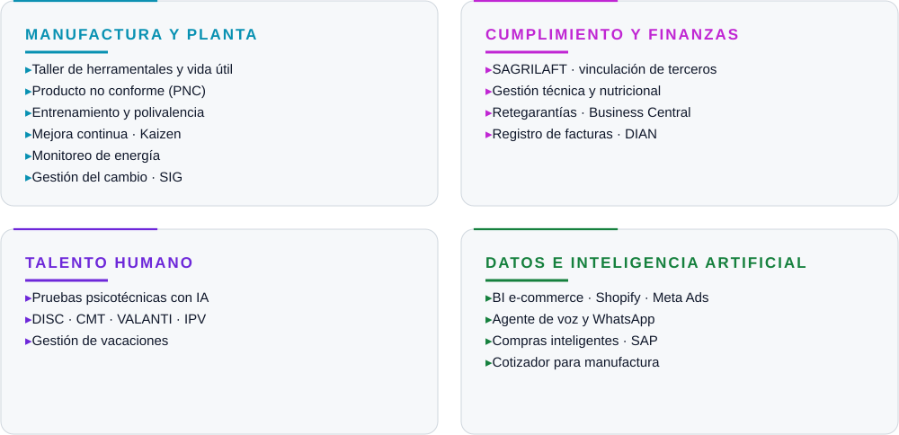
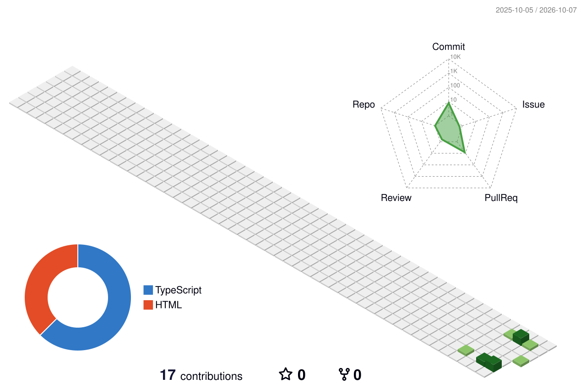

<picture>
  <source media="(prefers-color-scheme: dark)" srcset="assets/header-dark.svg">
  
</picture>

 

<picture>
  <source media="(prefers-color-scheme: dark)" srcset="assets/terminal-dark.svg">
  
</picture>

### 🧩 Lo que he construido

<picture>
  <source media="(prefers-color-scheme: dark)" srcset="assets/products-dark.svg">
  
</picture>

> Los repositorios son privados porque son proyectos de clientes. Si quieres una demo, escríbeme.

### 🛠️ Stack

  
   
  

  
  
  
  
  
  
  
  

### 📊 Actividad

  <picture>
    <source media="(prefers-color-scheme: dark)" srcset="https://streak-stats.demolab.com?user=jangaritarmeeteam&hide_border=true&background=0D1117&ring=FF2BD6&fire=00F0FF&currStreakLabel=00F0FF&sideLabels=E6EDF3&currStreakNum=E6EDF3&sideNums=E6EDF3&dates=8B949E&stroke=30363D&locale=es">
    
  </picture>

<picture>
  <source media="(prefers-color-scheme: dark)" srcset="profile-3d-contrib/profile-night-rainbow.svg">
  
</picture>

<picture>
  <source media="(prefers-color-scheme: dark)" srcset="https://raw.githubusercontent.com/jangaritarmeeteam/jangaritarmeeteam/output/snake-dark.svg">
  
</picture>
